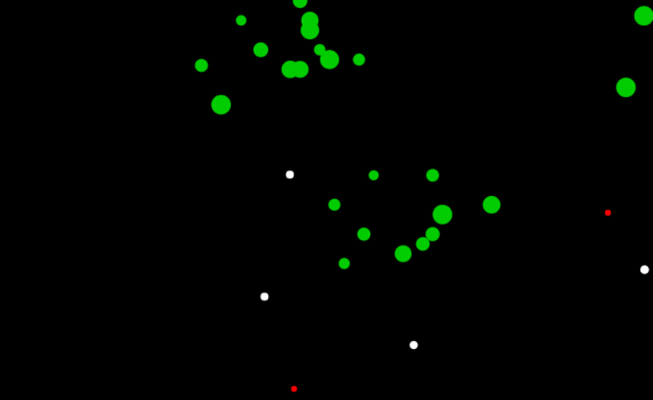

## Introduction
+ This project simulates the activities of grass, cow and wolf on the grassland.
+ **[Try it here](https://songwonderful.github.io/prairie-world/)**
+ Demo

## Hot key
|Key|Action|
|---|---|
|F11|Full screen; Note that doing this will reload the page.|
|R|Reload |
|G|Add a grass|
|C|Add a cow|
|W|Add a wolf|

## Notice
+ Inspired by [annotated-code](https://github.com/maryrosecook/annotated-code)
